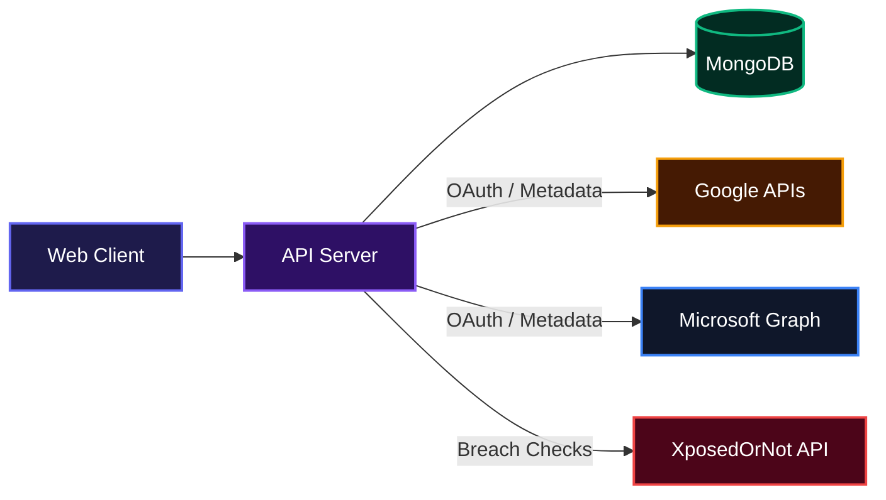
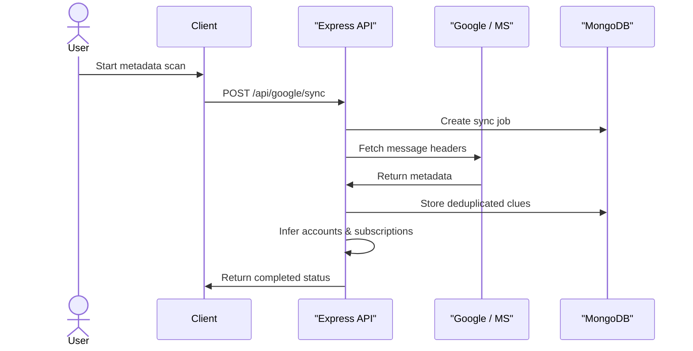

# OwnTrace

> Own your digital footprint.

OwnTrace is a personal digital identity and privacy control platform. It helps users discover where their online identity exists, understand privacy and security risks, prioritize what matters, take action, and monitor changes. It takes your scattered digital traces, processes them locally where possible, and provides exactly the insight you need to reclaim your privacy.

## System Architecture



## Status

Early development. The current website MVP includes the responsive public landing page, authentication, privacy-first onboarding, secure Gmail metadata sync, deterministic account and subscription discovery, protected account inventory, identity graph, account cleanup, dashboard, security/exposure views, manual opt-in verified breach checks through XposedOrNot, explainable Privacy Health, Privacy Inbox, manual privacy-request tracking, notifications, honest Google capability mapping, and password-confirmed OwnTrace data deletion. Automatic third-party privacy-request delivery is not yet integrated. The security review is documented, but production launch requirements remain.

## Features

- **Evidence-Based Discovery**: Safely scans metadata headers from connected mail accounts (Gmail, Microsoft) to infer services you use without reading your email bodies.
- **Privacy Dashboard**: A unified view of your discovered accounts, subscriptions, known breaches, and recommended privacy actions.
- **Identity Graphing**: Maps out relationships between your profile, connected email identities, discovered accounts, and primary domains.
- **Breach Checking**: Opt-in integration with XposedOrNot to verify if your email appears in known data leaks.
- **Actionable Inbox**: Prioritizes privacy tasks like securing breached accounts, reviewing dormant subscriptions, and deleting unused profiles.

### Metadata Scan Flow

When you authorize a mail provider, OwnTrace securely fetches metadata to discover your digital footprint safely.



## API Documentation

The backend provides a RESTful API. All protected endpoints require a valid session cookie.

### System & Health

**Check API Health**
`GET /api/health`
Checks if the server is running.
```json
{
  "success": true,
  "message": "OwnTrace API is running"
}
```

**Check Database Readiness**
`GET /api/health/ready`
Returns the status of the MongoDB connection.
```json
{
  "success": true,
  "status": "ready"
}
```

### Authentication

**Register a User**
`POST /api/auth/register`
Creates a new account and sets a session cookie.
Request body:
```json
{
  "name": "Jane Doe",
  "email": "jane@example.com",
  "password": "securepassword123"
}
```

**Login**
`POST /api/auth/login`
Authenticates a user and establishes a session.
Request body:
```json
{
  "email": "jane@example.com",
  "password": "securepassword123"
}
```

**Get Current Session**
`GET /api/auth/session`
Returns the active user if a valid session cookie is present.

**Logout**
`POST /api/auth/logout`
Revokes the current session and clears the cookie.

**Delete Account**
`DELETE /api/auth/account`
Permanently deletes the user account, revokes OAuth tokens, and wipes all associated data.
Request body:
```json
{
  "password": "securepassword123",
  "confirmation": "DELETE"
}
```

### Accounts & Discovery

**List Discovered Accounts**
`GET /api/accounts?page=1&limit=24&sort=lastSeen&direction=desc`
Returns the user's inferred accounts based on metadata scans.
```json
{
  "success": true,
  "accounts": [
    {
      "id": "60d5ec49f1",
      "serviceName": "Netflix",
      "primaryDomain": "netflix.com",
      "confidenceLevel": "CONFIRMED",
      "dormantStatus": "ACTIVE",
      "firstSeenAt": "2022-01-10T00:00:00.000Z",
      "lastSeenAt": "2023-10-15T00:00:00.000Z"
    }
  ],
  "pagination": {
    "limit": 24,
    "page": 1,
    "pages": 1,
    "total": 1
  }
}
```

**Get Account Summary**
`GET /api/accounts/summary`
Returns aggregate statistics about discovered accounts.

**Get Account Details**
`GET /api/accounts/:id`
Returns a specific account and the evidence signals that proved its existence.

**Get Identity Graph**
`GET /api/identity`
Returns the nodes and edges mapping the user's digital relationships.

### Privacy Features

**List Privacy Health**
`GET /api/privacy-health`
Calculates an explainable privacy score based on dormant accounts and active exposures.
```json
{
  "success": true,
  "health": {
    "confidence": "DERIVED_FROM_CURRENT_SIGNALS",
    "score": 72,
    "factors": [
      {
        "id": "dormantAccounts",
        "penalty": 10
      }
    ]
  }
}
```

**List Breach Insights**
`GET /api/breaches`
Returns saved security signals and cached verified breaches.

**Check Breaches**
`POST /api/breaches/check`
Triggers an external check against XposedOrNot using the user's email.
Request body:
```json
{
  "consent": true
}
```

**List Subscriptions**
`GET /api/subscriptions`
Returns recurring service detections derived from mail metadata.

**List Exposures**
`GET /api/exposures`
Returns a review queue of the service footprint and public exposure signals.

**List Privacy Requests**
`GET /api/privacy-requests`
Returns manual data deletion or access requests.

**Create Privacy Request**
`POST /api/privacy-requests`
Drafts a new privacy request record.
Request body:
```json
{
  "serviceName": "Old App",
  "requestType": "DELETE",
  "notes": "Requesting full data erasure."
}
```

**Update Privacy Request**
`PATCH /api/privacy-requests/:id`
Updates the workflow status of a request (e.g., DRAFT, READY, SENT, COMPLETED).
Request body:
```json
{
  "status": "SENT"
}
```

### Action Inbox & Notifications

**List Account Actions**
`GET /api/account-actions?status=OPEN`
Returns recommended next steps for managing digital footprint items.

**Update Account Action**
`PATCH /api/account-actions/:id`
Advances the status of a specific recommendation.

**List Notifications**
`GET /api/notifications`
Returns priority alerts for actions, privacy requests, and newly found breaches.

### External Integrations

**Google OAuth & Sync**
- `GET /api/google/connection`: Returns Google connection status.
- `GET /api/google/oauth/start`: Initiates the Google OAuth flow.
- `POST /api/google/sync`: Starts a new Gmail metadata scan job.
- `POST /api/google/sync/next`: Processes the next batch of emails.
- `DELETE /api/google/connection`: Revokes Google access and deletes the stored connection.

**Microsoft OAuth & Sync**
- `GET /api/microsoft/connection`: Returns Microsoft Graph connection status.
- `GET /api/microsoft/oauth/start`: Initiates the Microsoft OAuth flow.
- `POST /api/microsoft/sync`: Starts a new Microsoft inbox metadata scan.
- `POST /api/microsoft/sync/next`: Processes the next batch of emails.
- `DELETE /api/microsoft/connection`: Revokes Microsoft access and deletes the connection.

## Tech stack

- **Client**: React 19, Vite 8, JavaScript/JSX, React Router, Axios
- **Server**: Node.js 20+, Express 5, JavaScript
- **Database**: MongoDB, Mongoose
- **Integrations**: Google APIs, Microsoft Graph API, XposedOrNot
- **API style**: REST
- **Security**: Helmet, Express Rate Limit, bcryptjs, jsonwebtoken, AES-256-GCM encryption for stored tokens

## Local setup

Requirements: Node.js 20.19+ on the Node 20 release line, or Node.js 22.12+, matching Vite 8's supported runtime ranges; npm; and MongoDB.

```bash
npm install
npm run setup
```

Copy `./server/.env.example` to `./server/.env`. Configure `MONGO_URI` and a private `JWT_SECRET` of at least 32 characters. Never commit `./server/.env` or share its values.

### Environment Variables

```bash
NODE_ENV=development
PORT=5000
LOG_LEVEL=info
TRUST_PROXY=false
SHUTDOWN_TIMEOUT_MS=10000
CLIENT_ORIGINS=http://localhost:5173
MONGO_URI=mongodb://localhost:27017/owntrace
JWT_SECRET=supersecretjwtkey32charsminimum!
BCRYPT_ROUNDS=12
GOOGLE_CLIENT_ID=your_google_client_id
GOOGLE_CLIENT_SECRET=your_google_client_secret
GOOGLE_REDIRECT_URI=http://localhost:5000/api/google/oauth/callback
MICROSOFT_CLIENT_ID=your_microsoft_client_id
MICROSOFT_CLIENT_SECRET=your_microsoft_client_secret
MICROSOFT_REDIRECT_URI=http://localhost:5000/api/microsoft/oauth/callback
MICROSOFT_TENANT=common
CLIENT_APP_URL=http://localhost:5173
TOKEN_ENCRYPTION_KEY=32_byte_encryption_key_here!
GMAIL_SYNC_MESSAGE_LIMIT=2000
MICROSOFT_SYNC_MESSAGE_LIMIT=2000
```

Run the client and server together:

```bash
npm run dev
```

Or run them separately:

```bash
npm run dev:client
npm run dev:server
```

- Client: `http://localhost:5173`
- API health: `http://localhost:5000/api/health`

### Windows MongoDB DNS troubleshooting

If the server reports `querySrv ECONNREFUSED` for a `mongodb+srv://` connection and
`node -e "console.log(require('node:dns').getServers())"` prints `127.0.0.1`, use
Node.js `22.21.1` for local Windows development. A [Node.js/c-ares regression](https://github.com/nodejs/node/issues/62326) in affected
later Windows builds can select the loopback resolver even when Windows DNS is configured
correctly. Also confirm that MongoDB Atlas **Network Access** contains only the current
developer IP; do not solve local access by allowing `0.0.0.0/0`.

Run the backend authentication tests with an isolated in-memory MongoDB instance:

```bash
npm test
```

Production configuration, deployment, operations, rollback, and release blockers are documented in [`./docs/ENVIRONMENT.md`](./docs/ENVIRONMENT.md), [`./docs/DEPLOYMENT.md`](./docs/DEPLOYMENT.md), [`./docs/OPERATIONS.md`](./docs/OPERATIONS.md), and [`./PRODUCTION_READINESS.md`](./PRODUCTION_READINESS.md). The current verdict is not a public-production approval.

## Team

- [Anas2694](https://github.com/Anas2694)
- [RaphaelBlaster](https://github.com/RaphaelBlaster)

Feature ownership is documented in [`./docs/OWNERSHIP.md`](./docs/OWNERSHIP.md).

## Contribution workflow

1. Branch from `main` using the developer and feature name.
2. Implement one owned feature or shared foundation change.
3. Use a clear conventional commit message.
4. Push the feature branch and open a pull request into `main`.
5. Review before merging; do not develop directly on `main`.

Never commit real credentials, `.env` files, OAuth tokens, database connection strings, or user data.

---

[](https://dokugen.samueltuoyo.com)